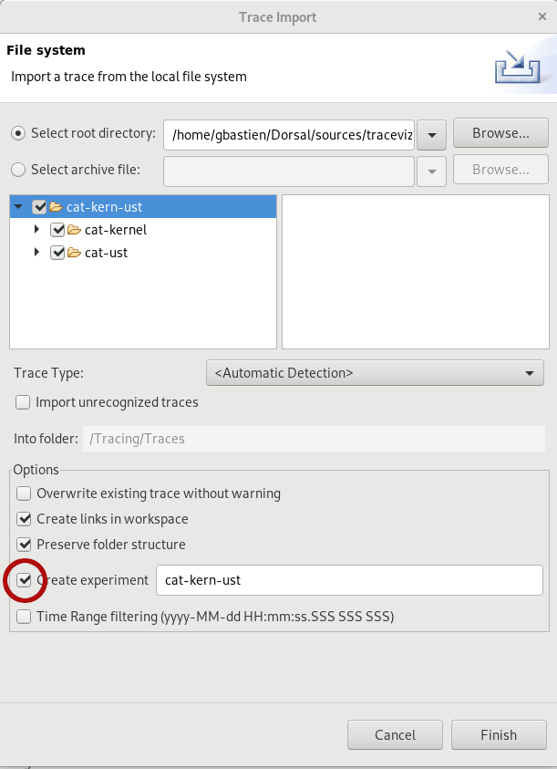
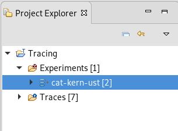

### Bug Hunt

In this lab, you'll be invited to find issues that have been purposefully introduced in an otherwise quite simple and straightforward program: `cat`.

*Pre-requisites*: This lab supposes that you are now familiar with kernel and some userspace trace visualization. You should have done the [kernel trace navigation](../01-trace-navigation-in-tracecompass), [kernel critical path](../01-tracing.wget-critical-path) and [userspace tracing](../02-lttng-userspace-tracing) labs.

- - -

#### Sub-task 1: Set Up and Run the Experiment

The `files/` directory of this lab contains a file named `cat.c`, which has been modified from coreutils to introduce some issues visible with tracing. **Do not look at the file!**. It is small enough that the issues will be obvious.

First, we'll need to install coreutils to add our cat.c file to it. If you did the [userspace tracing](../02-lttng-userspace-tracing) lab and compiled coreutils, skip this step:

```bash
$ git clone git://git.sv.gnu.org/coreutils
$ cd coreutils
$ ./bootstrap
$ ./configure CFLAGS="-g -O2 -finstrument-functions"
```

Now copy the `cat.c` file to coreutils

```
$ cp files/cat.c coreutils/src/
```

And type the `make` command in coreutils.

```
$ make
```

Now, let's trace this new modified `cat` version. We will trace using both kernel and userspace data, to get the full picture.

```
$ lttng-record-trace -p cyg_profile,libc,kernel,memory ./src/cat -n src/cat.c
```

The resulting trace will be in a `cat-k-u-(*)` directory.

- - -

#### Sub-task 2: Import in TraceCompass

To import traces in TraceCompass, you can right-click or your project's `Traces` folder, or click on the *File* menu, and select *Import...*. This will open the import wizard. You must select the directory where the traces are located, so the `cat-k-u-(*)` directory.

Click on the folder's name on the left side to select all traces under that folder. In the options below, make sure the *Create experiment* is checked, with an experiment in the textbox beside the option, as shown in the screenshot below.



The traces will be imported. Then expand the *Experiments* folder to see the experiment that was just created with the traces in it. Double-click on the experiment to open it.



- - -

#### Sub-task 3: Analyze the trace

You should now be able to use the notions learned in the previous labs to find the issues with the `cat` process. You can use all the kernel or userspace views available.

There are 4 separate issues in this example.

When you think you have find them all, you can look [at the solution](BugHuntResults.md).
