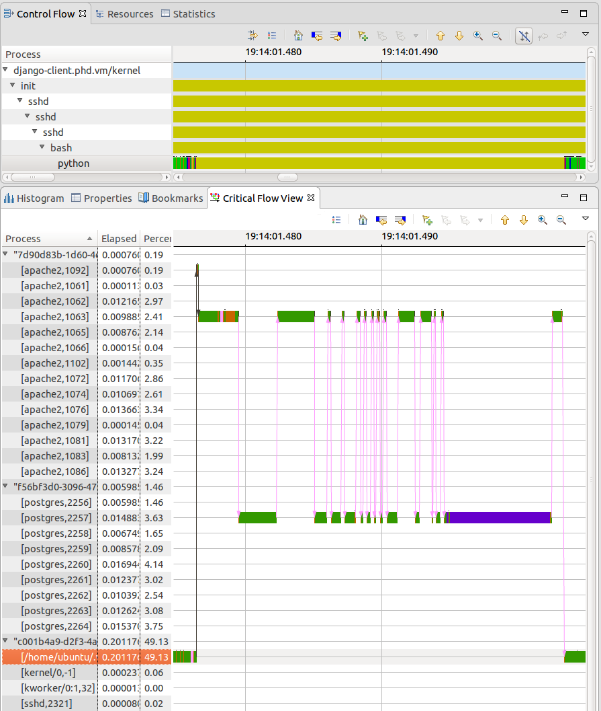
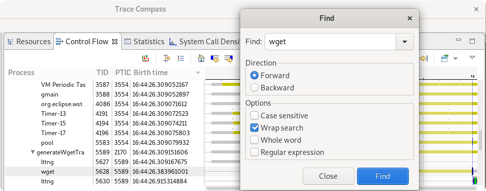
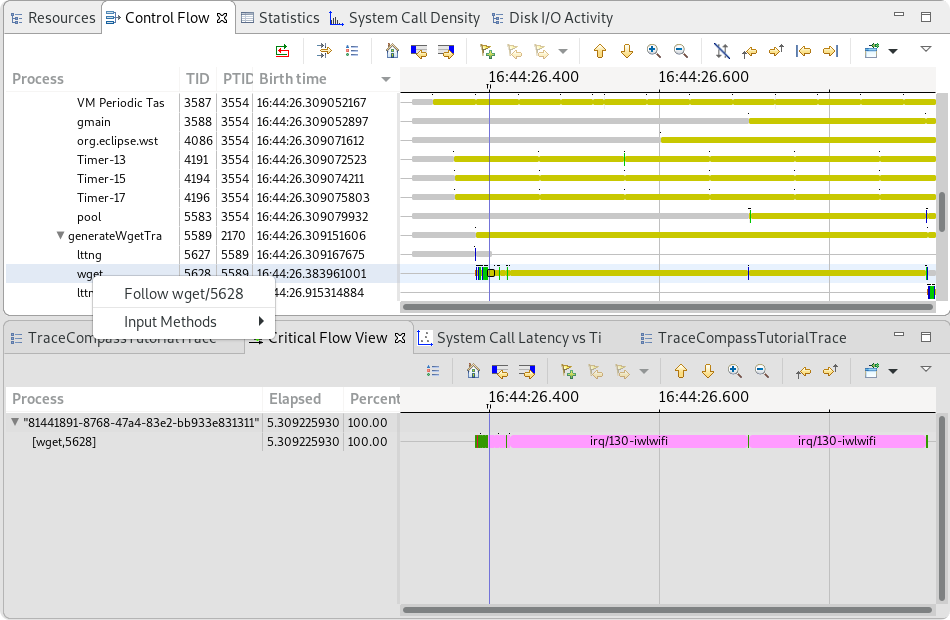
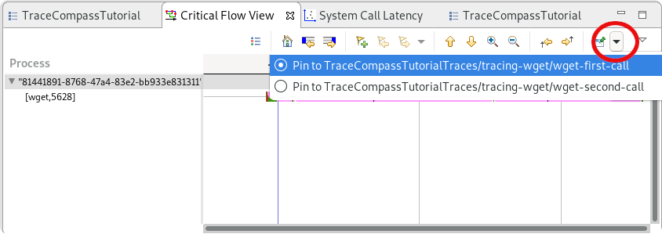
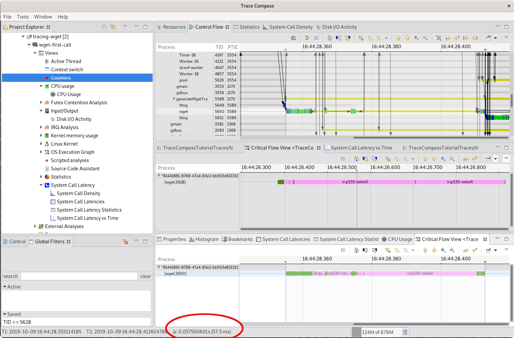

## Tracing wget and showing the critical path

In this lab, you will learn to view the critical path of a thread from the system's point of view, compare two executions of the same program and understand what is happening behind the scenes. In a program, a task may wait for something, for instance, the result of another task or the network. These wait dependencies are computed by the *OS Execution Graph* and can be seen using the critical path analysis. The critical path is the path that, if decreased, can decrease the duration of the application.



*Pre-requisites*: Have Trace Compass installed and opened. You can follow the [Installing TraceCompass](../006-installing-tracecompass/) lab or read the [TraceCompass web site](http://tracecompass.org) for more information. You also need to know how to record a trace and open it in Trace Compass. You can learn that by doing the [Record a kernel trace](../003-record-kernel-trace-lttng/) lab and the [Trace Navigation in Trace Compass](../101-trace-navigation-in-tracecompass/).

- - -

### Task 1: Recording two executions of wget

For this lab, we will look at 2 executions of the `wget` command. The traces can be recorded using [lttng-record-trace](https://github.com/tahini/lttng-utils)
or lttng directly to trace the command:

```
$ lttng-record-trace wget http://www.dorsal.polymtl.ca
```
or
```
$ lttng create
$ lttng enable-event -k -a
$ lttng start
$ wget http://www.dorsal.polymtl.ca
$ lttng destroy
```

The 2 traces provided with this lab did the exact same query. The first one, in the `wget-first-call` trace took 230 ms to complete, while the second one in `wget-second-call` took 10 times less.

:question: What hypotheses can we make to explain the differences in the execution time of wget?

- - -

### Task 2: Get the Critical Path Of The Trace

We first need to open the critical path view, either by pressing `ctrl-3` and searching for `Critical Flow` view, or in the `Project Explorer` it would be under the `Views` element under the trace, `OS Execution Graph` -> `Critical Flow View`.

Since we know which process we are interested in, we can search for it in the `Control Flow` view. We can hit the `ctrl-f` shortcut and type wget.



Once you have done that, you can right-click on the `wget` line and select `Follow wget/<tid>` where tid is the Thread ID of wget in your trace. As we can see, for this example, you would've selected `Follow wget/12243`. The `Follow <thread>` means we are interested in additional information on this thread and it will trigger all analyses and actions that concerns a single thread. The *Critical Path* analysis is one of them. After executing, the result of the critical path should appear in the `Critical Flow` view.



- - -

### Task 3: Understanding the Critical Path

The `OS Execution Graph` analysis that is the base of the critical path computes the dependencies between the threads only from the kernel events. It will try to explain the causes of a thread being blocked by following what triggered the wakeup of the thread. For example, the reception of a network packet will cause a wakeup event for the thread that was waiting for this packet. So we can infer that the thread was blocked waiting for network.

The `Critical Path` analysis starts from the end of the thread and moves back through the dependency chain to get the longest path of waiting for resources. It would find out if a process was waiting for a semaphore owned by another thread or if it was waiting on disk, etc.

In the case of the `wget` critical path we have it, there is no dependency with any other thread on the machine, as should be expected from such an application, so it looks like the line of the process of the `Control Flow` view, only that the **blocked** states are replaced by the reasons of the blocking. The following screenshot shows the legend of the `Critical Path` view.


We can understand from this that our `wget` thread was mostly waiting for disk in the beginning and network at the end.

- - -

### Task 4: Comparing two views

To compare two critical paths together, you need two `Critical Flow View` from the two traces. First, let's pin the view to one trace by clicking the down arrow next to the pin icon in the view.



Then in the view menu, at the right of the toolbar, select `new view, pinned to <second trace>`.


To display the critical path of the second trace, you can repeat task 2 for the second trace. Now both `Critical Flow` views should be populated with their respective `wget` critical paths.

- - -

### Task 5: Critical path analysis

You should now have the 2 critical paths side by side to compare their execution.


We can see the time difference between the two executions by simply selecting the range of the process activity for each critical path. The time span will be displayed at the bottom of the window.



We clearly see that the second critical path does not have the access to disk that we see in the beginning of the first one. The network phase is also much longer the first time than the next one.

We can thus answer our hypothesis from the beginning as to why there was a 10X time difference between the 2 executions:

 1) For the first trace, the `wget` binary was fetched from disk, while it was already in memory the next time.
 2) On the first query to the web page, the server probably had some setting up to do: Wake up a virtual machine on server? Fetch the page from disk? Cache the page?

If we had a trace of the server side, we would be able to better understand the network latency. We will do that in an [advanced lab](../301-tracing-multiple-machines) later in this tutorial.

- - -

### Conclusion

In the lab, you've learned how to use Trace Compass to find and compare the critical path of some wget process executions. The critical path can help find the root cause of why a process is particularly slow, why it was blocked.

- - -

#### Next

* [Compare Package Managers](../103-compare-package-managers)
or
* [Back](../) for more options
