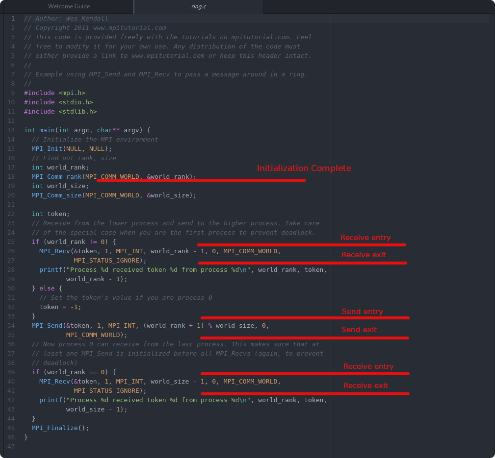

## Custom Userspace Tracing And Scripted Analyzes

In this lab, you will learn how to instrument your own application using LTTng userspace instrumentation. We'll instrument a C MPI application. If you do not want to instrument the application and go straight to the analysis part for custom traces, you can directly go to the [scripted analysis for custom instrumentation](../204-scripted-analysis-for-custom-instrumentation) lab

*Pre-requisites*: Have Trace Compass installed and opened. Have lttng-ust installed, most notably the `liblttng-ust-dev` package. You can follow the [Install LTTng on Ubuntu](../001-instal-lttng-on-ubuntu/) lab or read the [LTTng web site](http://lttng.org) for more information.

- - -

### Task 1: Understand The MPI Application To Trace

For this lab, we'll instrument an MPI application, taken from the [MPI tutorial](https://mpitutorial.com/) examples. We'll instrument the `ring` application, in which one mpi worker sends a value to the next and so on until the value comes back to the first worker. The complete instrumented files are in the [code](code/) directory of this lab. To compile and run it, you'll need the `openmpi` package (`sudo apt-get install openmpi`). A trace of the application is also available in the trace archive that comes with this tutorial.

```bash
$ git clone https://github.com/wesleykendall/mpitutorial.git
$ cd mpitutorial/tutorials/mpi-send-and-receive/code
```

The file to instrument will be the *ring.c* file. For more information on instrumenting applications, you can read the [complete documentation for instrumenting C/C++ applications with LTTng](https://lttng.org/docs/v2.10/#doc-c-application).

If we look at the [original ring.c](code/ring.c.orig) file, we can identify locations to instrument. We should instrument the following locations:

* After initialization: that's were we get the ID of the current MPI thread, so we will add the world_rank as a field.
* Before and after reception: We can identify the time spent waiting for a message. After the reception, we'll add the source of the message as a field.
* Before and after sending: To identify when we send the message to another worker. Before the send, we'll add the destination of the message as a field.



- - -

### Task 2: Define The Tracepoint Provider Files

The first step to instrument is to add the *tracepoint provider header file* that we will name `ring_tp.h`. This file contains the tracepoint definitions for all the tracepoints we'll insert. That's where we define their names, the fields to add and their types, etc.

```C
#undef TRACEPOINT_PROVIDER
#define TRACEPOINT_PROVIDER ring

#undef TRACEPOINT_INCLUDE
#define TRACEPOINT_INCLUDE "./ring_tp.h"

#if !defined(_RING_TP_H) || defined(TRACEPOINT_HEADER_MULTI_READ)
#define _TP_H

#include <lttng/tracepoint.h>

/* An event */
TRACEPOINT_EVENT(
    /* Tracepoint provider name */
    ring,
    /* Tracepoint class name */
    init,
    /* Input arguments */
    TP_ARGS(
        int, worker_id
    ),
    /* Output event fields */
    TP_FIELDS(
        ctf_integer(int, worker_id, worker_id)
    )
)

TRACEPOINT_EVENT(
    ring,
    recv_exit,
    TP_ARGS(
        int, worker_id
    ),
    TP_FIELDS(
        ctf_integer(int, source, worker_id)
    )
)

TRACEPOINT_EVENT(
    ring,
    send_entry,
    TP_ARGS(
        int, worker_id
    ),
    TP_FIELDS(
        ctf_integer(int, dest, worker_id)
    )
)

/* The tracepoint class */
TRACEPOINT_EVENT_CLASS(
    /* Tracepoint provider name */
    ring,
    /* Tracepoint class name */
    no_field,
    /* Input arguments */
    TP_ARGS(

    ),
    /* Output event fields */
    TP_FIELDS(

    )
)

/* Trace point instance of the no_field class */
TRACEPOINT_EVENT_INSTANCE(
    ring,
    no_field,
    recv_entry,
    TP_ARGS(

    )
)

TRACEPOINT_EVENT_INSTANCE(
    ring,
    no_field,
    send_exit,
    TP_ARGS(

    )
)

#endif /* _RING_TP_H */

#include <lttng/tracepoint-event.h>
```

Then we need to create the *tracepoint provider package source file*, which is a C source file that includes the *tracepoint provider header file* described above and is used to expand the tracepoint definition macros. That file will be named `ring_tp.c` and contains the simple following code:

```C
#define TRACEPOINT_CREATE_PROBES

#include "ring_tp.h"
```

Now we are ready to instrument the application itself.

- - -

### Task 3: Instrument The Application

- - -

### Task 4: Compile The Application

- - -

### Task 5: Trace an Instrumented application

```bash
$ lttng create
$ lttng enable-event -a -u
$ lttng add-context -u -t vtid
$ lttng start
$ mpirun -N 4 ./ring
$ lttng destroy
```

Since we are tracing userspace only, we need the `vtid` context, to identify the running thread.

- - -

### Conclusion

In the lab, you have compiled a program with tracing helpers, traced the `ls` command and saw the builtin views available for `LTTng UST` traces, ie the *LTTng-UST CallStack* and the *UST memory* views, as well as how we can leverage the userspace data with a system trace. You should now be able to analyze the execution of an application in details in terms of memory usage and function calls.

- - -

#### Next

* [Script Analyzes For Custom Instrumentation](../204-scripted-analysis-for-custom-instrumentation) to see how we can analyze and observe traces with custom instrumentation
or
* [Back](../) for more options
