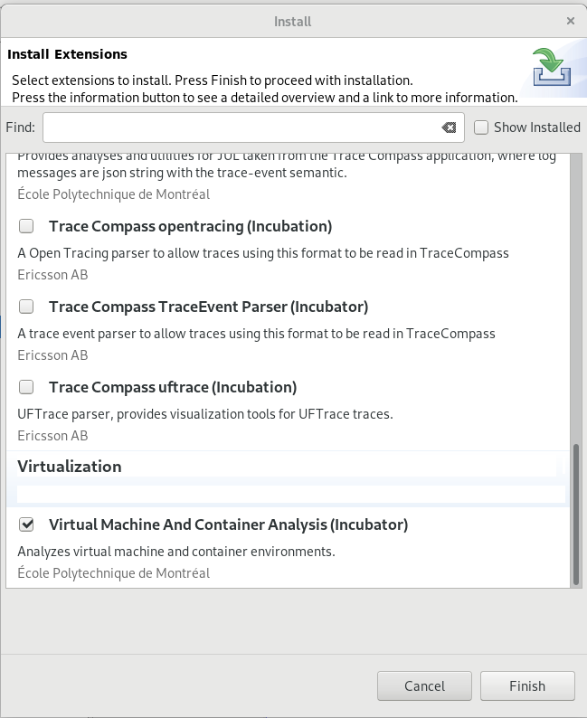
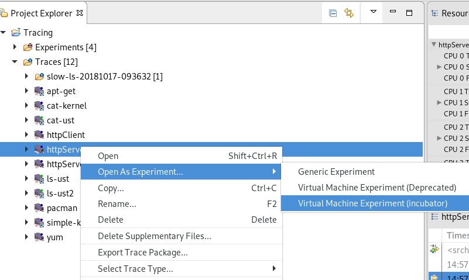
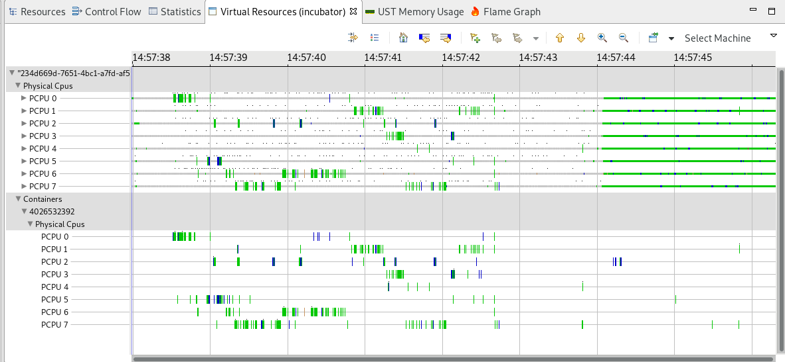
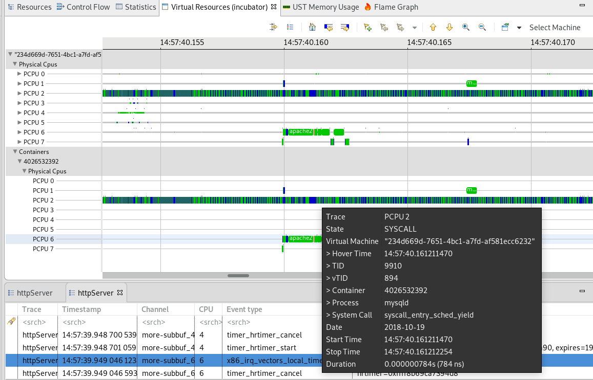

## System Tracing and Containers

In this lab, we will see the specifities of containers when it comes time to do system tracing and what Trace Compass can show about them.

*Pre-requisites*: Have Trace Compass installed and opened.

- - -

### Task 1: Understanding containers and system tracing

Containers are software schemes that allow to isolate runtime environments from other containers and the environment that hosts it. It has been compared with a `chroot` on steroids, where whole systems can run in complete isolation. It is much lighter than virtual machines because it shares a lot of resources with its host, and thus does not need a complete OS installation on the side, and its storage is often directly on the host system, so no need to assign disk files to the container.

One of the resources shared with the host is **the kernel**. There is one kernel for all the containers running in the machine. It is thus impossible for the container to do anything specific to the kernel, like installing modules or... tracing. So how can we trace containers? Simply said, by tracing the host. But tracing the host will see everything that happens on the system, ie the container we're interested in and all the other ones.

At the kernel level, containerization is managed using `cgroups` and `namespaces`. Processes and threads are assigned to cgroups and namespaces. By analyzing those associations, we can have a picture of our system's containerization. Namespaces can be nested within other namespaces.

Since containers are managed at very low level in the kernel, *tracing containers* does not require any additional modules, all the information is already in the trace, at least with `LTTng`. `ftrace` and `perf` do not seem to have the proper event fields.

- - -

### Task 2: Get a Trace for Containers

If you have access to a machine with containers, you may obtain a trace of that machine from the host itself. See the [trace recording lab](../003-record-kernel-trace-lttng/) for instructions on how to record a trace.

The `namespace` information is important to match threads and processes to containers. This information is available when forking a process, so in the `sched_process_fork` event. But for the process that are already started at the beginning of the trace, one needs the `lttng_statedump_process_state` event, that advertises the namespaces and virtual TIDs of each thread in each of those namespaces.

For a test trace, the `httpServer` trace of the [previous lab](../301-tracing-multiple-machines), in the `301-tracing-multiple-machines` directory, traced a web server in a docker container, so this trace can be used for this lab.

- - -

### Task 3: Install the Trace Compass Plugin for Container Analysis

To obtain additional views in Trace Compass for container analysis, you need to install the `Virtual Machine and Container Analysis (Incubator)` feature from the *Tools* -> *Addons...* menu and click *Finish*.

- - -

### Task 4:  Open the Trace as "Virtual Machine Experiment (incubator)"

The *Virtual Machine and Container* analyses are available for the *Virtual Machine* experiment type. So even though there is only one trace, you still need to open it as an experiment.

Import the trace like you would any other trace, then, in the `Project Explorer`, right-click on the trace and select *Open as Experiment...* -> *Virtual Machine Experiment (incubator)*. It will open the trace, and you can see it under the *Experiments* folder. It will have the same name as the trace that's inside.

- - -

### Task 5: View the container status

Expand the experiment you just opened in the `Project Explorer`, expand the `Views` item and `Fused Virtual Machine Analysis (incubator)`. Open the `Virtual Resources (incubator)` view.

This views shows the usage of the physical resources (CPU) by the several levels of container/virtualization. The first level shows everything that happens on the physical CPUs. Lower down in the view is the *Container* item, under which would appear all containers, sorted hierarchically (if there are nested containers). Each entry under that containers show the usage of the physical resources **by this container**.

We can highlight the usages of a single container by clicking on the *Select Machine* button and checking the container to highlight.

When we zoom in one the zones where there's a bit more activity on the container, we see the `apache2` and `mysqld` processes running. In the tooltip, we see the various TIDs of each thread at different levels of nesting. The following screenshots shows a mysqld state, where the real physical *TID* of the thread is 9910, which is the TID we should look for in the `Control Flow` view for instance, to get a critical path. But the *vTID* shows the TID from the container's perspective, so if ssh'ing into the container, we would recognize this process with TID 894.

- - -

### Conclusion

This lab has shown the current state of Trace Compass with regards to container. It can show how physical CPUs are being used by a container and can thus show in the same view what is happening on the machine that is not a container. So, for instance, we can analyze why a container is slow, see if other containers or host processes were doing contention on the resources, etc.

More work on containers is under way. Students at École Polytechnique are working on showing the resource usages wrt to the cgroup associated with a container. One could limit physical resource consumption using cgroup, and we want to show the status of the container in regards of those resources. Also, we may not be able to do kernel tracing in a container, but userspace tracing can be done, and could interact with lttng sessiond to exchange information that is not available to the host, etc.
